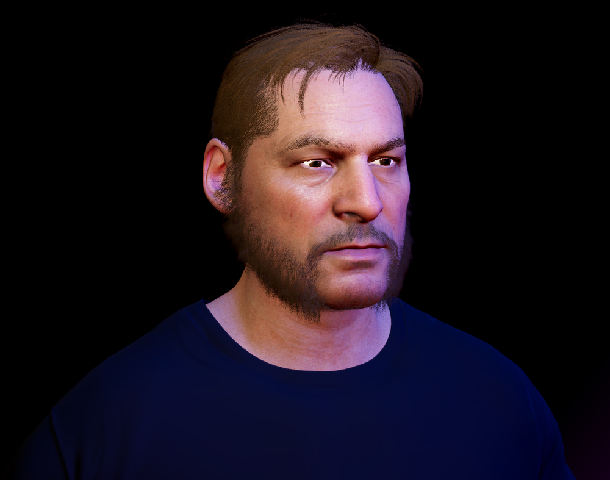
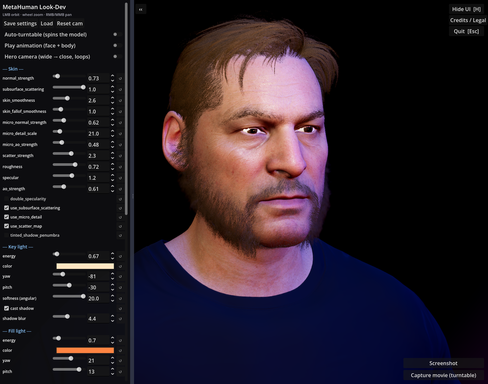
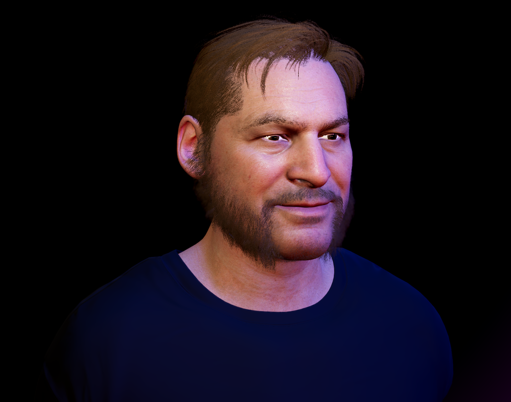

# MetaHuman → Godot Look-Dev

> ⚠️ **Not an Epic Games product.** This is an independent, community tool made by
> Agile Lens. It is **not** created, published, endorsed, sponsored by, or
> affiliated with Epic Games, and is **not** official MetaHuman or Unreal Engine
> software. The repository name "MetaHumanGodot" describes what the tool *works
> with* — it does not imply any official Epic support. "MetaHuman", "Unreal", and
> "Unreal Engine" are trademarks of Epic Games, Inc. See [Licensing](#licensing).

**MetaHumans rendered in stock Godot 4.6 (Forward+) — no engine fork, no custom
build.** A real-time look-development & turntable tool: dial in skin, lighting,
hair, and eyes with live sliders, drive the 52 ARKit facial blendshapes, match an
Unreal lighting scene, and capture stills / turntable movies. Skin uses the
[MatMADNESS](https://github.com/RustyRoboticsBV/GodotStandardLightShader)
HumanShader (MIT) for real subsurface scattering.



> **Bring your own MetaHuman.** This repo ships the *tooling* — the Godot project,
> the look-dev UI, and the skin/eye/hair shaders. It does **not** include any
> MetaHuman character assets. You supply your own export (see
> [Bring your own MetaHuman](#bring-your-own-metahuman)) and load it with the
> **Load custom character** button, or drop it at `character.glb`.

---

## The release tool — `scenes/release.tscn`

This is the headline scene (the project's default). It consolidates the two
earlier tools (`scenes/look_dev.tscn` and `scenes/match_lookdev.tscn`, both still
present and unchanged) into one "best of both worlds" look-dev environment:

- **Character toggle** — switch live between two built-in MetaHumans (a male and a
  female face), re-wiring skin / eyes / hair / hidden slots for each. Press **C**
  or click *Character: …*.
- **Load custom character** — a file dialog loads **any** `.glb`/`.gltf` at runtime
  (`GLTFDocument`), unit-normalizes mixed cm/m meshes, and best-effort wires skin
  (from the model's own baked textures) / eyes / hair by material-name heuristics.
  Degrades gracefully on unrecognized models — it still loads and renders, and the
  skin sliders drive whatever skin surfaces it could identify.
- **52 ARKit blendshapes** — a scrollable panel **shown by default** (toggle with
  **B**) with one named slider per canonical ARKit shape. Each drives `set_blend_shape_value`
  across **every** mesh carrying that shape, so the face *and* the propagated
  groom cards (beard/brows/'stache) deform together. Shapes a character lacks are
  shown disabled. *(The male character ships with the full set baked; see
  [ARKit blendshapes](#arkit-blendshapes).)*
- **Full look-dev controls** — skin (SSS, scatter, smoothness, normal, roughness,
  specular, micro-detail, SSS depth), hair (colour, alpha threshold, root
  darkening, roughness, specular, backing shell), eyes (sclera tint, iris
  scale/radius, roughness, specular, clearcoat), per-light energy **and** colour
  (key / key-rect / fill / rim / ambient point / catchlight), exposure / glow /
  env-ambient, **AgX** tonemap, **SSIL**, colour balance (saturation / brightness /
  contrast), model yaw, and a UE-frame-0 overlay. Every slider has a type-in box
  (values can exceed the slider range). An opt-in **hair rake** light skims the
  hairline so the hair throws a crisp shadow onto the forehead.
- **Animation** — an independent **face emote** (neutral → smile → surprise → frown
  → **nose scrunch** → smile, so the skin actually contorts), a **body idle** (a
  rigged weight-shift on characters with a skeleton, or a gentle procedural sway on
  static/boneless meshes), naturalistic **eye gaze** (look-at-camera + saccadic
  darts + blinks — driven by the eye bones when present, or by a faked iris-shift
  shader on boneless faces), a turntable, and a ping-pong **hero camera**.
- **Matched-to-Unreal rig** — the lights and camera are an exact port of a UE
  "Moonlight" CineCamera scene (cm→m, Z-up→Y-up, left→right-handed), so a Godot
  turntable lines up with the Unreal one. Energies are yours to tune.
- **Per-character presets + lighting library** — save/load JSON looks keyed per
  character. Ships a dozen-plus looks for each (`presets/<char>__<name>.json`):
  *moonlight, studio, beauty, clinical, noir, sunset, teal_orange* plus a lighting
  set — *golden_hour, rembrandt, cyberpunk, high_key, candlelight, split, overcast,
  emerald*. A **Cycle light colours** toggle animates the whole rig through the hue
  wheel for a live colour-shifting demo (non-destructive — toggling off restores the
  preset).
- **Headless capture** — render a still and a 120-frame turntable mp4 without the
  UI (see [Capture](#capture-stills--turntables)).

## Download

A prebuilt **Windows demo** (with a sample MetaHuman baked in) is on the
[**Releases**](../../releases) page — download `MetaHumanGodot-win64.zip`, unzip,
and run `MetaHumanGodot.exe`. Or build/run from source (below).

| The interactive tool | Live expressions |
| --- | --- |
|  |  |

## Quick start

1. Install **Godot 4.6** (stable, **Forward+** renderer).
2. Launch the release tool:
   - **Windows:** double-click `run_release.bat` (set the `GODOT` env var to your
     Godot binary if it isn't on `PATH`), **or**
   - **Any OS:** from a terminal —
     ```
     <godot-binary> --path <absolute-path-to-this-folder> scenes/release.tscn --resolution 1280x1280
     ```
     Use an **absolute** project path (a bare relative `--path` fails with
     *"Invalid project path specified"*).
3. With no MetaHuman present, use **Load custom character** to point at any GLB, or
   drop a MetaHuman export at `character.glb` (next section).

> Do **not** launch with `--headless` or `--write-movie` — this is an interactive
> GPU tool. The headless capture path below runs a normal (windowed) GPU context
> and quits itself.

The two original tools remain available: `scenes/look_dev.tscn` (the orbit-camera
MH_Test tuner, launchable via `run_lookdev.bat`) and `scenes/match_lookdev.tscn`
(the UE-matched explainer tuner).

## Controls

| Action | Input |
| --- | --- |
| Next character | **C** (or *Character: …* button) |
| Load custom character (GLB) | *Load custom character…* button |
| Toggle ARKit blendshape panel | **B** |
| Hide / show the look-dev panel | **H** |
| Toggle UE-frame-0 overlay | **O** |
| Save the current look to the character's default preset | **P** |
| Save-as / load a named preset | the **PRESETS** section |
| Screenshot / turntable movie | the **CAPTURE** section |

Every slider has a numeric entry box; type values beyond the slider range for
extremes. Presets are filtered to the active character.

## ARKit blendshapes

Modern (Mutable / MetaHumanCharacter) MetaHumans ship **no** ARKit morph targets —
the face is RigLogic/bone-driven. To get the 52 ARKit shapes into a non-Unreal
engine you must bake them: a Sequencer pass of `AS_MetaHuman_ARKit_Mapping`
(24 fps, one frame per pose) → FBX with resolved bone keyframes → per-pose
linear-blend-skinning in Blender → named shape keys (then propagate onto the
groom cards by nearest-neighbour so beard/brows deform with the face). The bundled
male character ships with this set baked. A face that has not been baked loads as a
static mesh and the blendshape sliders show as disabled — that's expected, not a bug.

## Capture (stills & turntables)

Interactive: use the **CAPTURE** section (Screenshot / Capture turntable). Output
lands in `out/release/`.

Headless (for regenerating matched side-by-sides):
```
RELEASE_CHAR=guy RELEASE_CAPTURE=1 [RELEASE_MOVIE=1] [MOVIE_FRAMES=120] \
  <godot-binary> --path <abs> scenes/release.tscn --resolution 1080x1080
```
`RELEASE_CHAR` is `her` or `guy`. `RELEASE_CAPTURE` renders `release_<char>_still.png`;
add `RELEASE_MOVIE` for a 120-frame turntable assembled to mp4 via OpenCV (`cv2`;
falls back from H.264 to `mp4v` if no OpenH264). QA hooks: `RELEASE_BS="jawOpen=1.0,
mouthSmileLeft=0.8"` drives shapes; `RELEASE_CUSTOM=<abs path>` exercises the custom
loader; `RELEASE_TOGGLE=1` switches character once before capture.

## Bring your own MetaHuman

Export your MetaHuman from Unreal Engine and assemble it into a single
`character.glb` at the project root, with its baked textures alongside (head/body
BaseColor, Normal, SRMF, Scatter; eye iris/sclera; groom coverage atlases). The
"guy" profile auto-wires the face by **surface index** (Blender's glTF export
shuffles material names), plus the body skin, grooms, and eyes. For any other
model, use **Load custom character** — it wires by material name and unit-normalizes
automatically. *(The full automated UE → Blender → Godot export pipeline — which
produces `character.glb` for you, including the ARKit morph bake — is a separate
offering; see [The full pipeline](#the-full-pipeline).)*

## Licensing

- **This tool's code + shaders:** see `LICENSE` (MatMADNESS shaders are MIT). The
  preset JSONs in `presets/` are plain look settings (no MetaHuman data).
- **MetaHuman assets are NOT included and must not be added to this repo.** They
  are Epic "Non-Engine Products"; Epic's MetaHuman license (June 2025+) permits
  MetaHumans in non-Unreal engines for users under $1M USD revenue, with
  restrictions (notably **no AI-model training**). When you supply your own
  MetaHuman, you do so under **your** Epic license — read
  [metahuman.com/license](https://www.metahuman.com/license) and the
  [Unreal Engine EULA](https://www.unrealengine.com/eula/unreal). This note is
  not legal advice.

## The full pipeline

This viewer is the open, free slice. The complete **UE → Blender → Godot
automation** (one-shot export of the face/body/grooms, surface remapping, shader
wiring, the ARKit morph bake, animation setup) is a separate, more involved
offering and is **not** part of this public repo. If you want the turnkey workflow
rather than hand-assembling `character.glb`, that's where to look.
